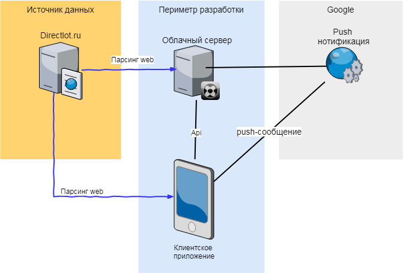

# DirectlotApp
Мобильное приложение - клиент к сайту торговли б/у вещами [directlot.ru](http://directlot.ru) (аналог авито). Специализация портала - купля/пордажа технических приборов, инструментов, материалов, книг. Данный портал не имеет мобильной версии сайта и мобильных клиентов.

Получить API у администрации сайта пока не получается. Для получения данных предлагается парсить сайт как мобильным клиентом, так и отдельным облачным сервером (который будет оперативно написан для этого проекта). В данном проекте будут реализованы только функции покупателя.

### Мобильное приложение
Функции мобильного приложения:
1) Вывод списка последних размещенных товаров;
2) Фильтрация по разделам и поиск;
3) Отслеживание просмотренных товаров;
4) Подписка на push-уведомления по интересующим товарам (чтобы быстрее других среагировать и купить);

### Дополнительные функции (если будет время и возможности):
5) Реализации процесса покупки;
6) Ведение переписки с продавцом;
7) Хранение заготовок для переписки (Адрес, стандартный ответ - благодарность)

### Серверное приложение
Чтобы упростить парсинг сайта directlot.ru, для уменьшения трафика  и для реализации функции push-уведомления предлагается использовать облачное серверное приложение. 

Функции серверного приложения:
1) Парсинг сайта directlot.ru
2) Хранение лотов товаров
3) Хранение подписки пользователей и рассылка push-уведомлений

### Схема

### Парсинг
Основные url для парсинга:
- [http://directlot.ru/products.php](http://directlot.ru/products.php) - список лотов (товаров)
- http://directlot.ru/lot.php?id={$id лота} - информация по лоту

Источники картинок:
- http://directlot.ru/img-lot-prev/51/l{$id лота}-1.jpg
